# XA-Practica3-2025
El objetivo de esta práctica es desplegar nuestra aplicación desplegada en las prácticas anteriores junto con la base de datos PostgreSQL, Redis y los servicios de monitorización en un clúster de Kubernetes. Se deberá crear un pipeline de CI/CD con Github Actions para simular el despliegue continuo

## 1- Guia de setup
### Prerrequisitos
Instalar:
- Docker Desktop
- K3d
- Helm
- .NET SDK 8.0
- Make (recomendado)
- Añadir 

Adicionalmente del helm obtener los siguentes repositorios con los  comandos:
```
helm repo add ingress-nginx https://kubernetes.github.io/ingress-nginx

helm repo add prometheus-community https://prometheus-community.github.io/helm-charts

helm repo add grafana https://grafana.github.io/helm-charts
```

### 1.1- Preparar variables de entorno
Generar los siguentes archivos:
```
env/dev/terraform.tfvars
env/pro/terraform.tfvars
```
De la misma carpeta deberías de tener un archivo variables.tf que son las variables a rellenar es las tfvars con los valores que consideres
### 1.2- Desplegar entornos
Para desplegar pro:
```
make create-pro-cluster
make setup-pro 
```
Para desplegar dev:
```
make create-dev-cluster
make setup-dev
```

## 2- Partes del proyecto y diagrama de arquitectura
| Servicio | Descripción |
|---|---|
|WebApi|Servicio web|
|NGINX ingress (balanceador)|Balancea la carga entre las réplicas del servicio anterior (WebApi) siguiendo el algoritmo round robin|
|PostgreSQL|Base de datos|
|Redis|Cache de la base de datos (solo disponible en Pro)|
|MinIO|Gestor de imágenes|
|Prometheus|Métricas|
|Grafana|Dashboards y alertas|

Diagrama:

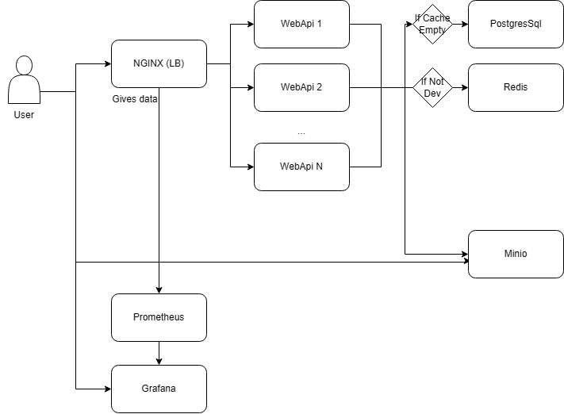


## 3- Tests utilizados y outputs

### Aplicación Web, Base de Datos y Caché:
Tras desplegar si se ha añadido a /etc/hosts la resolución DNS: 127.0.0.1 app.dev/pro.localhost se podrá acceder a la web a traves de:
```
http://webapi.dev.local:5000
o
http://webapi.pro.local:9000
```
Al igual que en la práctica anterior, se puede insertar y borrar productos, y en producción se puede tirar la base de datos y sigue habiendo datos (aunque no se pueden modificar)
Con BD y cache:
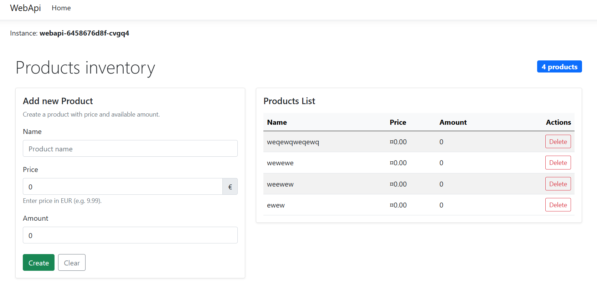

Solo cache:
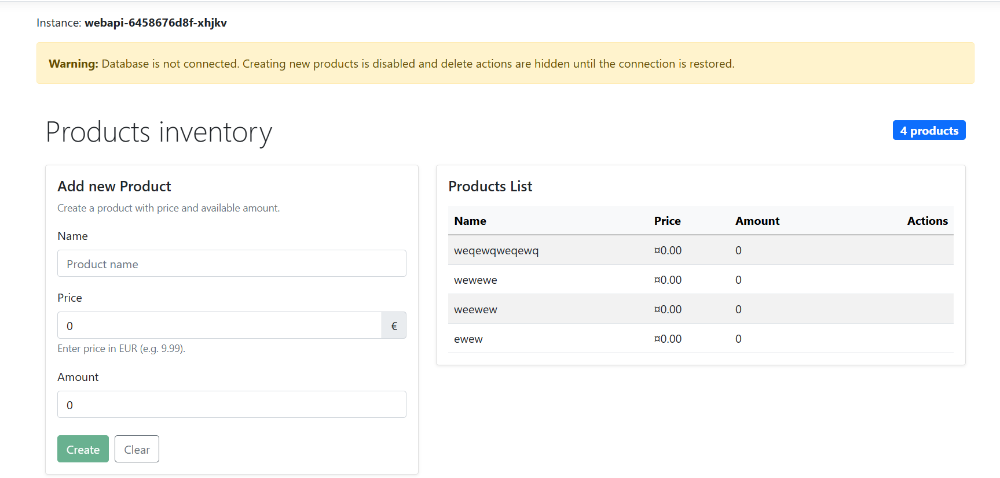

Adicionalmente, se puede desplegar dev y pro al mismo tiempo:
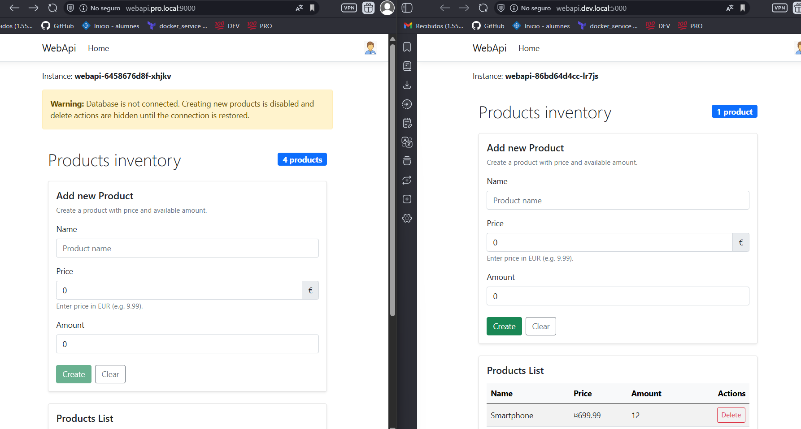

### Balanceador de Carga:
Cada vez que se carga la web se puede observar que la instancia cambia y concuerda con las instancias en docker:
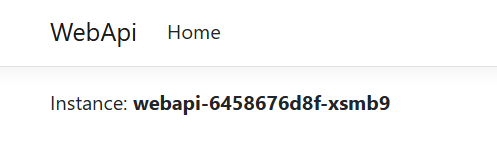
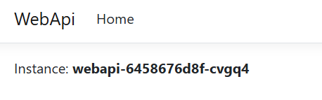

### Monitorización y Logs:
Con el comando:
```
kubectl port-forward -n monitoring svc/prometheus-server 9090:80
```
Se puede acceder a prometheus http://localhost:9090/query donde se puede observar que se están consumiendo correctamente los datos:
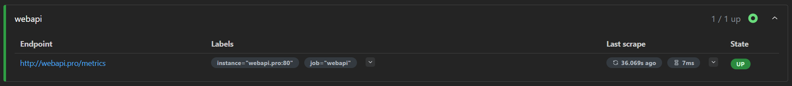

Con el comando:
```
kubectl port-forward -n monitoring svc/grafana 3000:80
```
Se puede acceder a grafana: http://localhost:3000 se obtiene auto el datasource y se generan gráficas automáticamente:
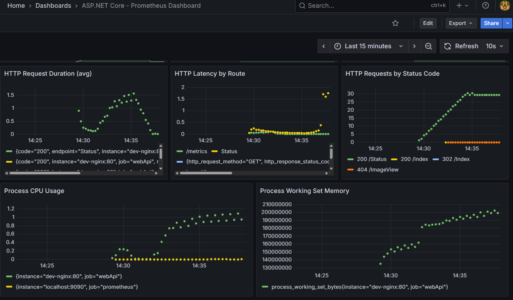

Adicionalmente en alerts podemos ver la alerta creada:
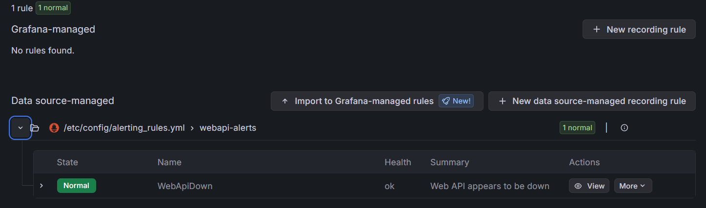

### Almacenamiento de Archivos:
Desde la web se ha creado una página para insertar imágenes:
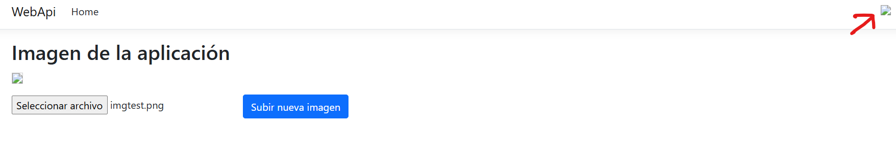

Se actualiza en la cabecera:
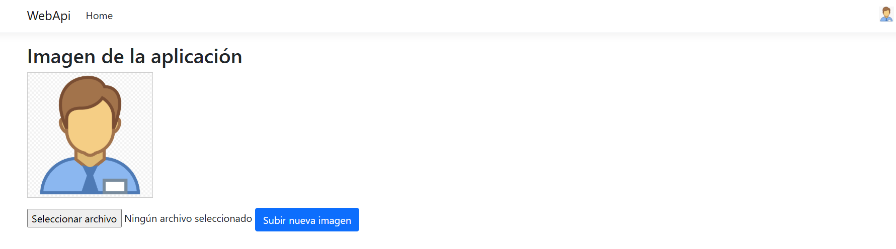

Y se puede ver desde la ui de minio si se ejecuta:
```
kubectl port-forward svc/minio 9001:9001 -n dev/pro
```
en http://localhost:9001 se podrá acceder:

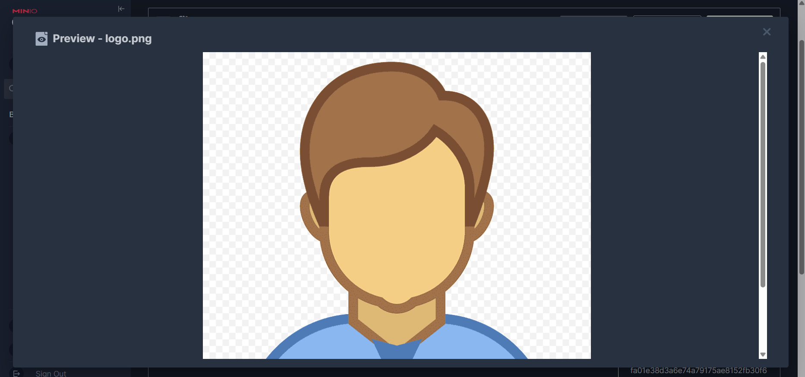


## 4- Uso del makefile
| Comando                   | Descripción             |
| ------------------------- | ----------------------- |
| `make create-dev-cluster` | Crea cluster dev        |
| `make create-pro-cluster` | Crea cluster pro        |
| `make dev`                | Cambia contexto a dev   |
| `make pro`                | Cambia contexto a pro   |
| `make setup-dev`          | Despliegue completo dev |
| `make setup-pro`          | Despliegue completo pro |
| `make destroy-dev`        | Borrado completo de dev |
| `make destroy-pro`        | Borrado completo de pro |